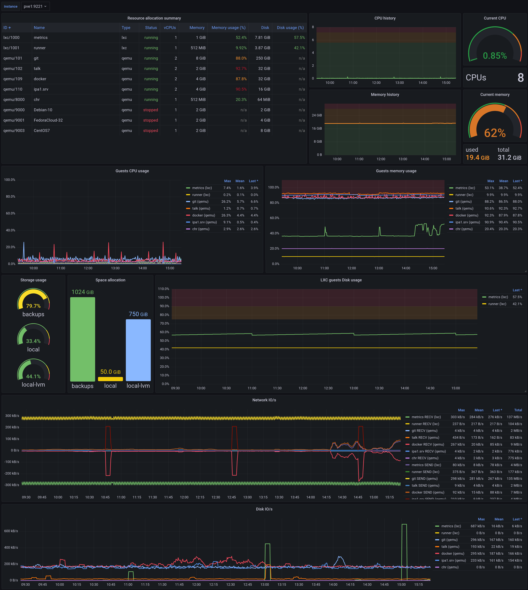

# proxmox-via-prometheus-dashboard
Grafana Dashboard for Proxmox using Prometheus

Repository for [this](https://grafana.com/grafana/dashboards/10347-proxmox-via-prometheus/) Grafana dashboard.
The dashboard displays data scraped from [prometheus-pve-exporter](https://github.com/prometheus-pve/prometheus-pve-exporter).

Repo to keep track of the changes to the dashboard and collect issues (better than reviews).

# Screenshots

